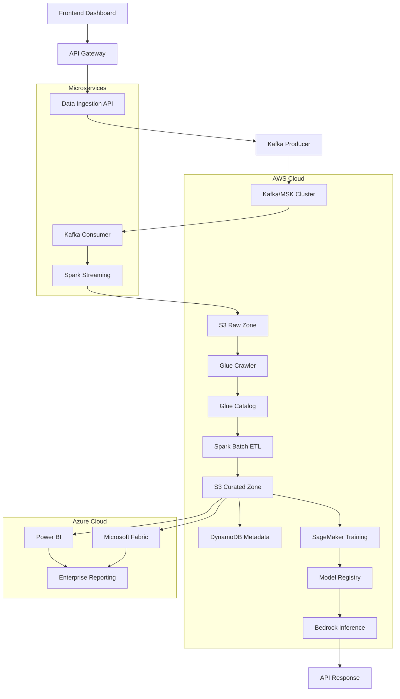

# Architecture Diagram

```mermaid
graph TB
    A[Frontend Dashboard] --> B[API Gateway]
    B --> C[Data Ingestion API]
    C --> D[Kafka Producer]
    D --> E[Kafka/MSK Cluster]
    E --> F[Kafka Consumer]
    F --> G[Spark Streaming]
    G --> H[S3 Raw Zone]
    H --> I[Glue Crawler]
    I --> J[Glue Catalog]
    J --> K[Spark Batch ETL]
    K --> L[S3 Curated Zone]
    L --> M[DynamoDB Metadata]
    L --> N[SageMaker Training]
    N --> O[Model Registry]
    O --> P[Bedrock Inference]
    P --> Q[API Response]
    L --> R[Power BI]
    L --> S[Microsoft Fabric]
    R --> T[Enterprise Reporting]
    S --> T

    subgraph "AWS Cloud"
        E
        H
        I
        J
        K
        L
        M
        N
        O
        P
    end

    subgraph "Azure Cloud"
        R
        S
        T
    end

    subgraph "Microservices"
        C
        F
        G
    end
```